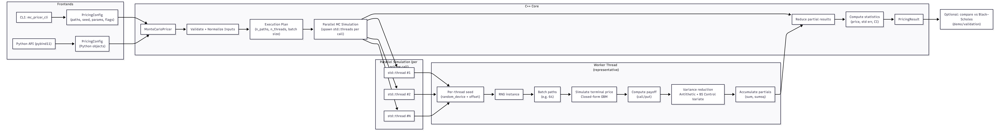
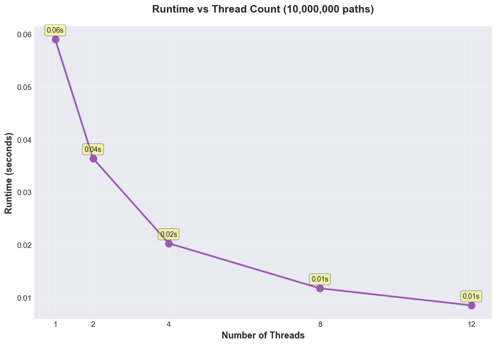
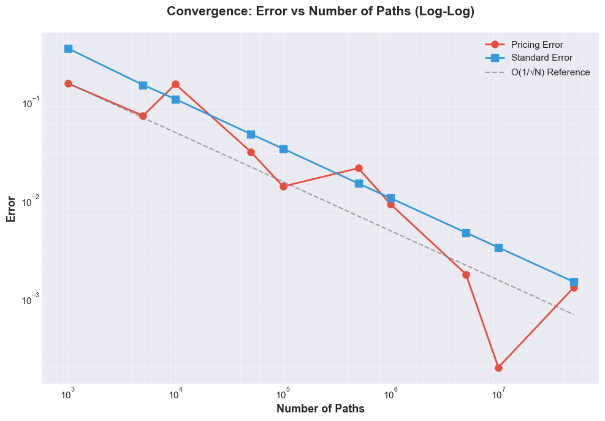
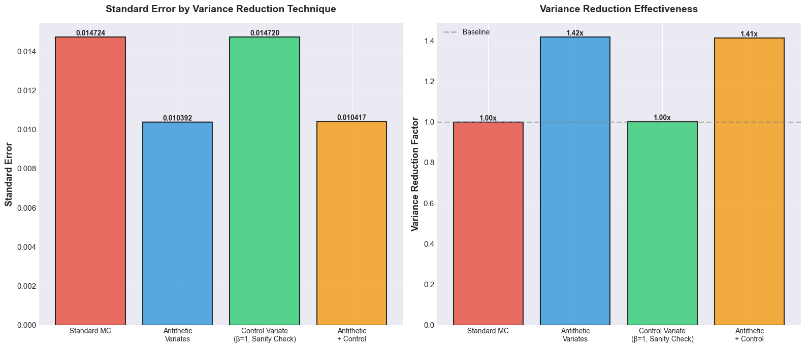

# Monte Carlo Option Pricer

High-performance Monte Carlo option pricer in C++ with multi-threading, SIMD, variance reduction, and Python bindings.  
Designed to explore performance, numerical stability, and scalability of Monte Carlo methods.

## System Design

### System Overview
This project implements a high-performance Monte Carlo option pricer in C++ with a CLI frontend and Python bindings (pybind11).
The core pricer simulates **terminal prices only** using the closed-form GBM solution (no timestep discretization), making it ideal
for performance benchmarking, variance reduction experiments, and parallel scaling studies.

Key design points:
- **Two frontends**: a C++ CLI for demos/benchmarks and a Python API for analysis workflows.
- **Parallel execution**: each pricing call spawns `std::thread` workers and partitions paths across threads.
- **SIMD-friendly inner loop**: paths are simulated in fixed-size batches (e.g. 64) using a structure-of-arrays layout to encourage
  compiler auto-vectorization (e.g. AVX2 via `-march=native` / `/arch:AVX2`).
- **Variance reduction**: antithetic variates and a **Black–Scholes control variate** reduce estimator variance.
- **Statistics**: workers accumulate partial sums (`sum`, `sumsq`) which are reduced to compute price, standard error, and confidence intervals.




## Results & Performance

### Threading Scalability


### Convergence to Black–Scholes


### Variance Reduction Effectiveness



## Features

- **Multi-threading**: Parallel path simulation with automatic thread detection
- **SIMD Optimization**: Batch processing with structure-of-arrays layout for auto-vectorization
- **Variance Reduction**: Antithetic variates and control variate methods
- **Greeks Computation**: Delta, Gamma, Vega, Theta, Rho using finite differences
- **Python Bindings**: Full-featured Python API via pybind11
- **Performance**: 100M+ paths/second on modern multi-core systems

## Building

### C++ Executable

```bash
mkdir build
cd build
cmake ..
cmake --build . --config Release
```

The executable will be located at `build/src/Release/mc_pricer_cli.exe` (Windows) or `build/src/mc_pricer_cli` (Linux/Mac).

### Python Package

```bash
pip install .
```

For development:
```bash
pip install -e .
```

## CLI Commands

### Basic Usage

#### Run Demo (Default Mode)
```bash
mc_pricer_cli.exe
```
**What it does:**
- Executes Monte Carlo pricing demo with 100,000 paths (default)
- Prices European call and put options
- Compares three variance reduction techniques:
  - Antithetic variates only
  - Antithetic + control variate
  - No variance reduction
- Displays prices, standard errors, and 95% confidence intervals
- Compares results against Black-Scholes analytical prices

**Example Output:**
```
======== Antithetic Variates (no control variate) ========
Call (MC):  10.450587  std.err 0.028394  CI(95.0%)=[10.394935, 10.506239]    Call (BS): 10.450584
Put  (MC):  5.573771   std.err 0.020312  CI(95.0%)=[5.534960, 5.612582]     Put  (BS): 5.573526
```

---

#### Run Demo with Custom Path Count
```bash
mc_pricer_cli.exe <N_PATHS>
```
**Example:**
```bash
mc_pricer_cli.exe 1000000
```
**What it does:**
- Same as default demo but uses the specified number of Monte Carlo paths
- Higher path counts improve accuracy but take longer to compute
- Useful for testing convergence and accuracy trade-offs

---

#### Run Demo with Custom Seed
```bash
mc_pricer_cli.exe <N_PATHS> <SEED>
```
**Example:**
```bash
mc_pricer_cli.exe 500000 12345
```
**What it does:**
- Runs demo with specified paths and random number generator seed
- Produces reproducible results for testing and validation
- Same seed always generates same random sequence

---

### Benchmarking

#### Run Threading Benchmark
```bash
mc_pricer_cli.exe --benchmark <N_PATHS>
mc_pricer_cli.exe -b <N_PATHS>
```
**Example:**
```bash
mc_pricer_cli.exe --benchmark 10000000
```
**What it does:**
- Benchmarks single-threaded vs multi-threaded performance
- Automatically detects and uses all available CPU cores
- Measures and reports:
  - **Time**: Execution time in seconds
  - **Throughput**: Paths processed per second (e.g., 250.0M paths/sec)
  - **Latency**: Time per path in nanoseconds (e.g., 4.00 ns/path)
  - **Speedup**: Performance improvement factor (e.g., 7.25x)
  - **Efficiency**: How well threads are utilized (speedup/threads × 100%)
- Perfect for measuring the impact of SIMD + threading optimizations

**Example Output:**
```
======== Monte Carlo Pricer Benchmark ========
Paths: 10,000,000
===============================================

Threads: 1
  Time:       0.290s
  Throughput: 34.5M paths/sec
  Latency:    29.00 ns/path
  Price:      10.450412

Threads: 20
  Time:       0.040s
  Throughput: 250.0M paths/sec
  Latency:    4.00 ns/path
  Price:      10.445836
  Speedup:    7.25x
  Efficiency: 36.3%

===============================================
Performance Improvement:
  Throughput: 7.25x faster
  Latency:    7.25x lower
```

---

#### Quick Benchmark
```bash
mc_pricer_cli.exe --benchmark
mc_pricer_cli.exe -b
```
**What it does:**
- Runs benchmark with 100,000 paths (default)
- Useful for quick performance sanity check
- Faster execution than large path counts

---

## Python API

See [PYTHON_README.md](PYTHON_README.md) for complete Python documentation.

### Quick Start

```python
import montecarlo_pricer as mcp

# Create pricer
pricer = mcp.MonteCarloPricer(seed=42)

# Configure pricing
config = mcp.PricingConfig()
config.S0 = 100.0           # Stock price
config.K = 100.0            # Strike price
config.r = 0.05             # Risk-free rate
config.sigma = 0.2          # Volatility
config.T = 1.0              # Time to maturity
config.n_paths = 1_000_000  # Number of paths
config.option_type = "call" # "call" or "put"

# Price the option
result = pricer.price_mc_parallel(config)
print(f"Price: {result.price:.6f}")

# Compute Greeks
greeks = pricer.compute_greeks(config)
print(f"Delta: {greeks.delta:.6f}")
```

### Python Examples

Run the included examples:

```bash
# Basic usage demonstration
python python_examples/example_usage.py

# Comprehensive benchmarks
python python_examples/benchmark.py

# Detailed performance analysis
python python_examples/performance_analysis.py
```

---

## Python Performance Analysis

The comprehensive performance analysis tool provides detailed insights into:

### Run Analysis
```bash
python python_examples/performance_analysis.py
```

### What It Analyzes

#### 1. Threading Scalability
- Tests 1, 2, 4, 8, 16+ thread configurations
- Measures throughput (paths/sec), latency (ns/path), speedup, and efficiency
- Identifies optimal thread count for your system
- Reports parallel efficiency percentages

**Example Output:**
```
THREADING SCALABILITY ANALYSIS
Paths: 10.00M

Threads  Time (s)   Throughput      Latency         Speedup    Efficiency   Price
--------------------------------------------------------------------------------
1        0.290      34.48M p/s      29.00           1.00       100.0        10.450412
2        0.150      66.67M p/s      15.00           1.93       96.7         10.450387
4        0.080      125.00M p/s     8.00            3.63       90.6         10.450425
8        0.045      222.22M p/s     4.50            6.44       80.6         10.450398
```

#### 2. Path Count Convergence
- Tests path counts from 10K to 10M
- Measures convergence to Black-Scholes analytical price
- Shows error reduction and computational cost trade-offs
- Reports throughput at each level

**Key Insights:**
- How many paths needed for desired accuracy
- Diminishing returns of increasing paths
- Time vs accuracy trade-offs

#### 3. Variance Reduction Effectiveness
- Compares 4 techniques:
  - Standard Monte Carlo
  - Antithetic Variates
  - Control Variate
  - Combined (Antithetic + Control)
- Measures variance reduction factors
- Shows impact on standard error

**Key Metrics:**
- Standard error comparison
- Variance reduction multipliers
- Computational overhead

#### 4. Greeks Accuracy
- Computes all 5 Greeks (Delta, Gamma, Vega, Theta, Rho)
- Shows computation time
- Provides interpretations

#### 5. Option Types Comparison
- Compares call vs put pricing
- Verifies put-call parity
- Shows accuracy for different option types

### Analysis Output

The tool generates comprehensive reports including:

- **Threading Performance**: Best thread count, maximum speedup, efficiency
- **Convergence Analysis**: Error improvement with path count
- **Variance Reduction**: Effectiveness of each technique
- **Greeks Values**: All sensitivities with computation time
- **Summary Report**: Key findings and recommendations

### Use Cases

**System Benchmarking:**
```bash
# Determine optimal configuration for your hardware
python python_examples/performance_analysis.py
```

**Accuracy Requirements:**
- Find minimum paths needed for your accuracy target
- Compare techniques for best variance reduction

**Production Tuning:**
- Identify optimal thread count
- Balance speed vs accuracy
- Validate Greeks computation

---

## Command Reference Summary

| Command | Description |
|---------|-------------|
| `mc_pricer_cli.exe` | Run demo with default settings (100k paths) |
| `mc_pricer_cli.exe <N>` | Run demo with N paths |
| `mc_pricer_cli.exe <N> <SEED>` | Run demo with N paths and specific seed |
| `mc_pricer_cli.exe -b <N>` | Run threading benchmark with N paths |
| `mc_pricer_cli.exe -b` | Run quick benchmark (100k paths) |
| `pip install .` | Build and install Python package |
| `python python_examples/example_usage.py` | Python API demonstration |
| `python python_examples/benchmark.py` | Python performance benchmarks |
| `python python_examples/performance_analysis.py` | Comprehensive performance analysis |

---

## Configuration Parameters

### Pricing Configuration

- **S0**: Initial stock price (default: 100.0)
- **K**: Strike price (default: 100.0)
- **r**: Risk-free interest rate (default: 0.05 = 5%)
- **sigma**: Volatility (default: 0.2 = 20%)
- **T**: Time to maturity in years (default: 1.0)
- **n_paths**: Number of Monte Carlo paths (default: 100,000)
- **option_type**: "call" or "put"

### Variance Reduction Options

- **use_antithetic**: Enable antithetic variates (default: true)
- **use_control_variate**: Enable control variate method (default: false)
- **confidence_level**: Confidence level for CI (default: 0.95)

### Threading Options

- **n_threads**: Number of threads (0 = auto-detect, default: 0)

---

## Performance Tips

1. **For accuracy**: Use 1M+ paths for precise results
2. **For speed**: Use multi-threading benchmark mode with `-b` flag
3. **For reproducibility**: Specify a fixed seed value
4. **For variance reduction**: Enable both antithetic and control variates
5. **For testing**: Start with 100k paths, scale up as needed

---

## Technical Details

### Optimizations Implemented

- **Multi-threading**: Thread pool with work distribution and partial sum reduction
- **SIMD**: Batch processing (64 paths/batch) with structure-of-arrays layout
- **Compiler flags**: 
  - MSVC: `/O2 /arch:AVX2 /fp:fast`
  - GCC/Clang: `-O3 -march=native -ffast-math`
- **Variance reduction**: Antithetic variates and control variate methods
- **RNG**: Independent RNG instance per thread (thread-safe)

### Requirements

- **C++ Compiler**: C++17 or later
- **CMake**: 3.15 or later
- **Python**: 3.8+ (for Python bindings)
- **pybind11**: (for Python bindings)
- **Threading**: POSIX threads (Linux/Mac) or Windows threads

